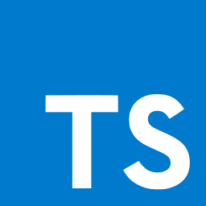

    
    
Twitter clone

    

    
Purpose: sharing Knowledge!

    
Everybody is welcome, regardless of your skill level. 😊

    

        
        
        
        
        
        
        
        
        
    

    

        
        
        
    

# Introduction

Welcome to the **Twitter Clone App** repository! This open-source project is designed to foster collaboration and knowledge sharing among developers. The application replicates core features of Twitter and serves as a platform to learn and grow together as a community. Everybody is welcome!

<h2>Purpose</h2>

This project is <strong>non-commercial</strong> and is aimed at:

    <ul>
        <li>Learning and experimenting with modern web technologies</li>
        <li>Sharing knowledge and best practices</li>
        <li>Collaborating with other developers</li>
    </ul>

<h2>Tech Stack</h2>
    <ul>
        <li><strong>Language:</strong> TypeScript </li>
        <li><strong>Monorepo:</strong> Nx Monorepo</li>
        <li><strong>Frontend:</strong> React, React query, styled-components</li>
        <li><strong>Backend:</strong> NestJS, Prisma</li>
        <li><strong>Database:</strong> PostgreSQL</li>
    </ul>

<h2>Features</h2>
    <ul>
        <li>User authentication and authorization</li>
        <li>Tweet creation and interaction (likes, retweets, comments)</li>
        <li>Follow/unfollow functionality</li>
        <li>Real-time updates with WebSockets</li>
        <li>Notifications</li>
        <li>Hashtags and Trends</li>
        <li>Direct Messaging</li>
        <li>Search Functionality</li>
        <li>Media Uploads</li>
        <li>Analytics Dashboard</li>
        <li>Polls</li>
        <li>Tweet Scheduling</li>
        <li>Accessibility Features</li>
        <li>Multi-language Support</li>
    </ul>

      <h2>Getting Started</h2>

  <h3>Prerequisites</h3>
  <ul>
    <li>Node.js (v20.x)</li>
    <li>pnpm (v9.x)</li>
    <li>Docker and Docker Compose</li>
  </ul>

  <h3>Installation</h3>
  <ol>
    <li><strong>Fork the repository</strong></li>
     
    <li>
      <strong>Clone the repository:</strong>
      <!-- <pre><code>git clone https://github.com/Pajkic-lab/twitter-clone.git</code></pre> -->    
    </li>
     
    <li>
      <strong>Set up the environment variables:</strong>
      <ul>
        <li>Copy <code>.env.example</code> template file content and create <code>.env.development</code> file for development and <code>.env.staging</code> for the staging environment.</li>
        <li>For the staging environment, you should change <code>DATABASE_URL_PG</code> value, which you can find in the <code>docker-compose</code> file.</li>
      </ul>
    </li>
    <li>
      <strong>Set up app for development:</strong>
      <ul>
        <li>This command sets the app environment. Run it initially and whenever you change the environment:</li>
        <pre><code>pnpm run dev:set</code></pre>
        <li>Run the app:</li>
        <pre><code>pnpm run dev</code></pre>
      </ul>
    </li>
    <li>
      <strong>Set up app for staging:</strong>
      <ul>
        <li>This command sets the app environment. Run it initially and whenever you change the environment:</li>
        <pre><code>pnpm run staging:set-local</code></pre>
        <li>Run the app:</li>
        <pre><code>pnpm run staging-local</code></pre>
      </ul>
    </li>
  </ol>

  <h3>Contributing</h3>
  
Twclone code is open-source. We are committed to a transparent development process and highly appreciate any contributions. Whether you are helping us fix bugs, proposing new features, improving our documentation, or spreading the word - we would love to have you as a part of the TWclone community. Please refer to our <a>contribution guidelines</a> and <a>code of conduct</a>.

  <ul>
    <li><strong>Bug Report:</strong> If you see an error message or encounter an issue while using TWclone, please create a bug report.</li>
  </ul>

////////////////////////////////////////////////////////////////////////////////////////////////////////////////////////////////////

Special thanks to media team for promoting us

////////////////////////////////////////////////////////////////////////////////////////////////////////////////////////////////////

### Licensing of Contributions

By contributing, you agree that your work will be licensed under the same **CC BY-NC-SA 4.0** license as the project.

## License

This project is licensed under the **Creative Commons Attribution-NonCommercial-ShareAlike 4.0 International (CC BY-NC-SA 4.0)**.

You are free to:

- **Share**: Copy and redistribute the material in any medium or format.
- **Adapt**: Remix, transform, and build upon the material.

Under the following terms:

- **Attribution**: You must give appropriate credit, provide a link to the license, and indicate if changes were made.
- **NonCommercial**: You may not use the material for commercial purposes.
- **ShareAlike**: If you remix, transform, or build upon the material, you must distribute your contributions under the same license.

## Acknowledgments

Thank you to all contributors and the open-source community for supporting this project. Together, we can create something amazing!
